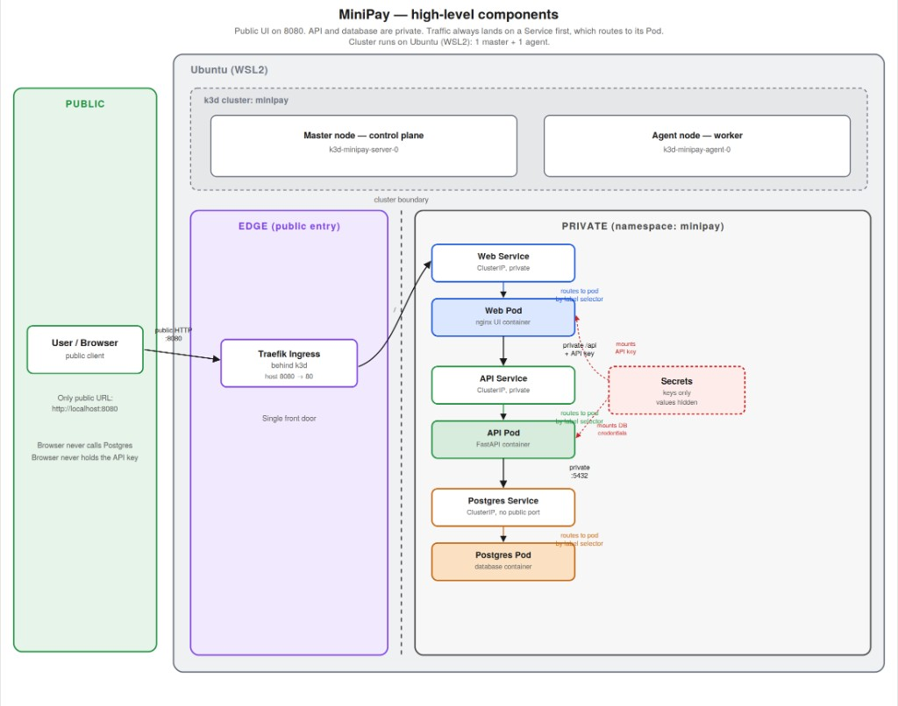

# Architecture

MiniPay is a payments console, REST API, and PostgreSQL database. The diagram is the **Kubernetes (k3d)** path on Ubuntu (WSL2): one public URL, private API and database.

Public UI on **8080**. API and database stay private. Traffic always lands on a **Service** first, which routes to its **Pod**. Secrets stay in-cluster.

The cluster is **k3d `minipay`**: 1 master (`k3d-minipay-server-0`) and 1 agent (`k3d-minipay-agent-0`).

## Trust boundaries

| Zone | Component | Who can reach it |
|---|---|---|
| Public | Browser | `http://localhost:8080` only |
| Edge | Traefik Ingress (k3d load balancer) | Host **8080** → cluster **80**. Single front door |
| Private | Web Service → Web Pod (nginx) | Ingress only. ClusterIP |
| Private | API Service → API Pod (FastAPI) | Web only, via `/api` (nginx adds `X-API-Key`). ClusterIP, no host port |
| Private | Postgres Service → Postgres Pod | API only, **5432**. ClusterIP, no NodePort |
| Private | Secrets | Mounted into Web (API key) and API (DB credentials). Values never on a public arrow |

The browser does not call Postgres and does not hold the API key.

## Request path (k3d)

1. Browser → `http://localhost:8080`
2. k3d load balancer **8080 → 80** → Traefik
3. Ingress `minipay` (`path /`) → **Web Service** → **Web Pod** (nginx)
4. UI assets stay on Web. `/api`, `/health`, and `/ready` proxy to **API Service** → **API Pod** (process listens on **8000**)
5. API → **Postgres Service** → **Postgres Pod** (`:5432`)

Each Service selects its Pod by label. Do not run Compose `web` and k3d on **8080** at the same time.

## Compose vs Kubernetes

Same three processes (`web`, `api`, `db`). Different exposure:

| Port | Compose (localhost bind) | Kubernetes (k3d) |
|---|---|---|
| **8080** | UI (`web`) | UI via Ingress (only public port) |
| **8000** | API, for pytest and curls | Not published. Reach API through **8080** |
| **5432** | Postgres, for `psql` and the L2 CLI | In-cluster only. Exec into `minipay-db-0` or use Compose for SQL work |

## Config and secrets

Non-secrets: environment / ConfigMap `minipay-config` (`DB_HOST=minipay-db`, `API_UPSTREAM=minipay-api:80`, `APP_PORT=8000`).

Credentials: `.env` locally, Kubernetes Secret `minipay-secrets` (`DB_PASSWORD`, `API_KEY`, `DATABASE_URL`). Never hard-code values. Never commit `.env`.

## Health

- `/health` — process is up (liveness). No dependency checks.
- `/ready` — database ping (readiness). **503** if Postgres is down.

Liveness must not point at `/ready`.
