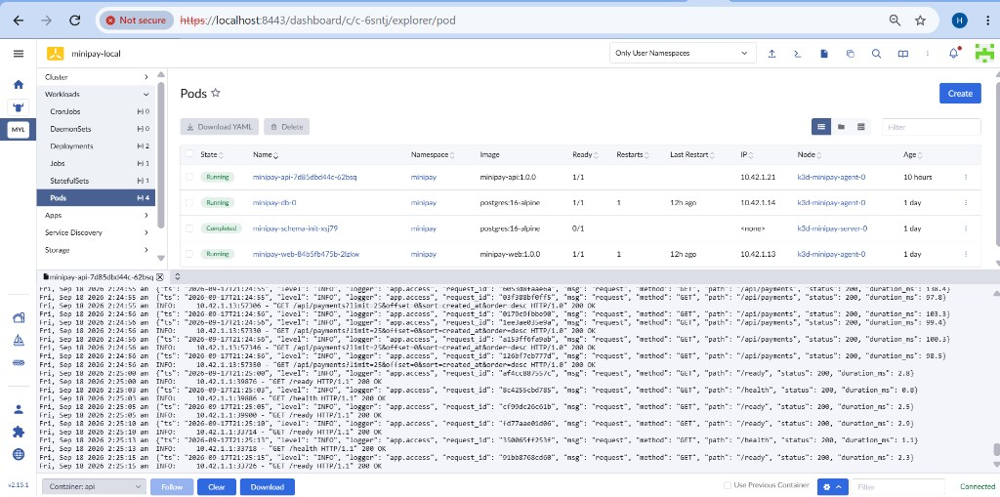
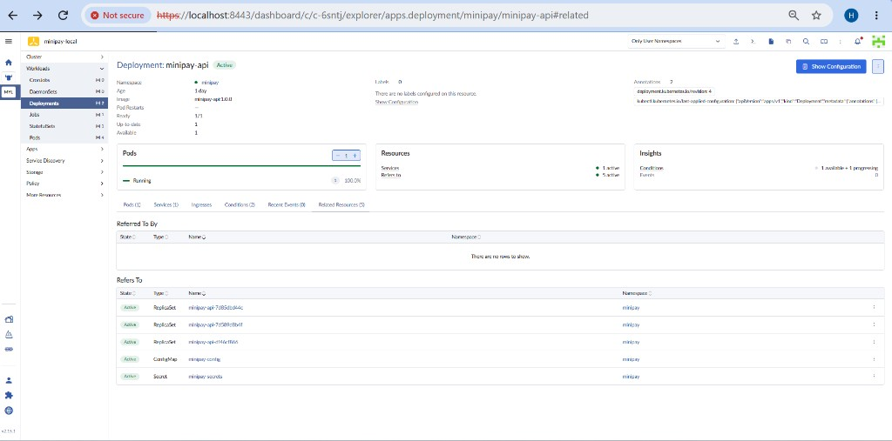
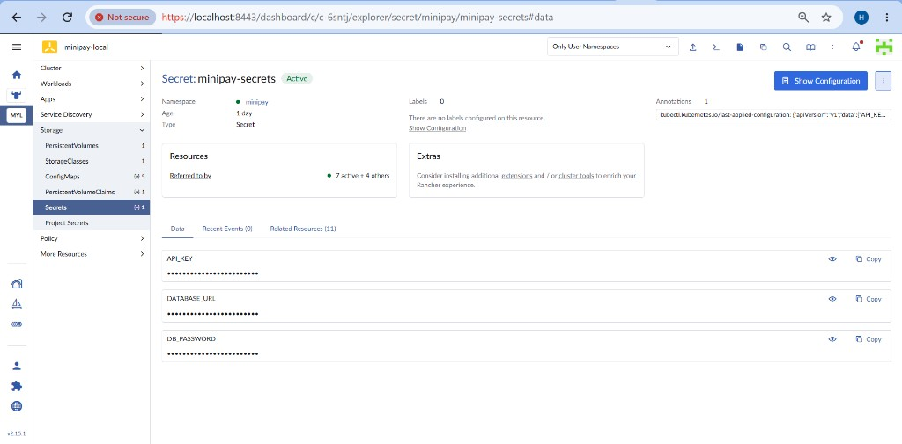
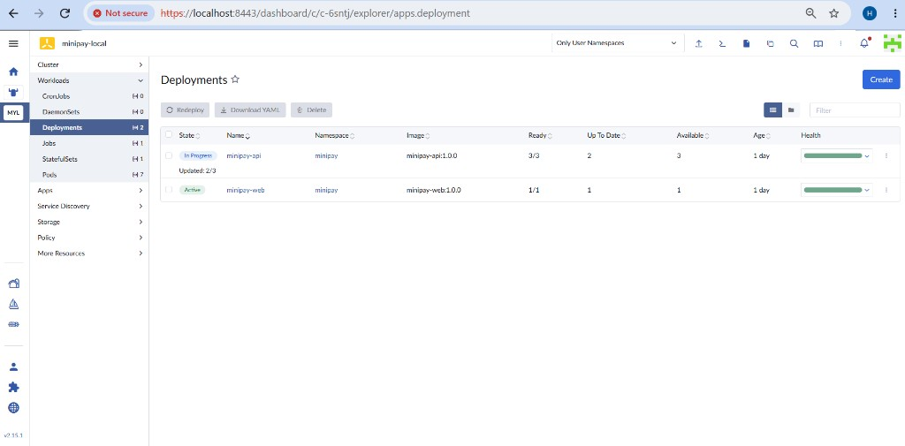
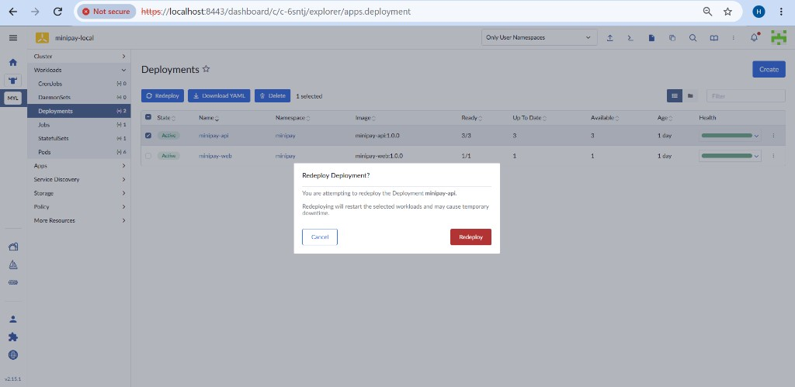
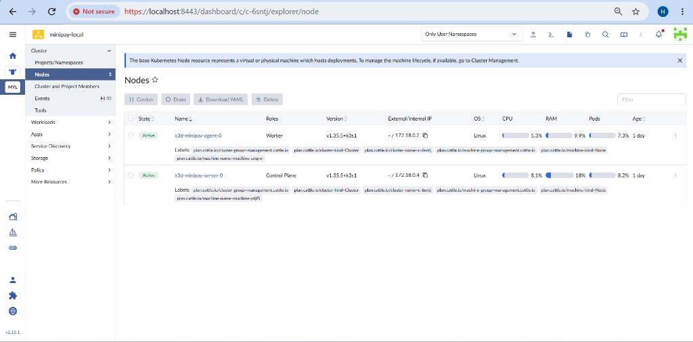

# Rancher — import and operations (k3d minipay-local)

Rancher v2.15.1 in Docker; k3d cluster **`minipay`** imported as **`minipay-local`**.  
`server-url` set to **`https://host.docker.internal:8443`** so the cluster agent inside k3d can reach Rancher on Docker Desktop (WSL).

---

## Setup

```bash
docker run -d --name rancher --restart=unless-stopped --privileged \
  -p 8081:80 -p 8443:443 \
  rancher/rancher:latest

docker logs rancher 2>&1 | grep "Bootstrap Password:"
```

Browser: **`https://localhost:8443`** (HTTPS required on port 8443).

Import: **Cluster Management → Import Existing → Generic → minipay-local → Create**, then apply the manifest on k3d:

```bash
kubectl config use-context k3d-minipay

curl --insecure -sfL https://host.docker.internal:8443/v3/import/<REDACTED>.yaml | kubectl apply -f -
```

Import troubleshooting (WSL + k3d):

- Agent with `CATTLE_SERVER=https://localhost:8443` failed: `ping is not accessible` (localhost inside pod ≠ host).
- `host.k3d.internal` failed: `Could not resolve host`.
- **`host.docker.internal`** resolved to `192.168.65.254` from pods; agent connected (`Connected to proxy`).

---

## Cluster dashboard

Active imported cluster: 2 nodes, 10 deployments, capacity (pods/CPU/memory), component health (Etcd, Scheduler, Cattle, Fleet).


---

## Workloads overview

User namespaces: **minipay** — 2 Deployments, 1 Job, 1 StatefulSet, 4 Pods (3 Running, 1 Completed).


---

## Deployments (minipay namespace)

`minipay-api` and `minipay-web` — Active, Ready 1/1.


---

## Job — schema init

`minipay-schema-init` — Completed 1/1 (postgres:16-alpine).


---

## StatefulSet — database

`minipay-db` — Active, Ready 1/1 (postgres:16-alpine, PVC).


---

## Pods (minipay namespace)

Pod status: `minipay-api`, `minipay-web`, `minipay-db-0` Running; `minipay-schema-init` Completed.


---

## Pod logs

`minipay-api` pod — API access logs (`/health`, `/ready`, `/api/payments`).



---

## Environment / config

Deployment **Related Resources** — refers to `minipay-config` ConfigMap and `minipay-secrets` Secret.



Secret keys (`API_KEY`, `DATABASE_URL`, `DB_PASSWORD`) — values redacted in UI.



---

## Scale (3 replicas)

Scaled `minipay-api` from 1 → 3 in Rancher (Ready 3/3).



---

## Redeploy

Redeploy confirmation for `minipay-api` in Rancher.



---

## Scale and rollout (kubectl verification)

```bash
huzaifa@H:/mnt/d/Interviews/Paysys/minipay-platform$ kubectl -n minipay get pods -l app=minipay-api
kubectl -n minipay rollout status deploy/minipay-api --timeout=120s
kubectl -n minipay get deploy minipay-api
NAME                           READY   STATUS    RESTARTS   AGE
minipay-api-6ccdb787c9-2frp9   1/1     Running   0          50s
minipay-api-6ccdb787c9-p2jvr   1/1     Running   0          40s
minipay-api-6ccdb787c9-t5nvw   1/1     Running   0          62s
deployment "minipay-api" successfully rolled out
NAME          READY   UP-TO-DATE   AVAILABLE   AGE
minipay-api   3/3     3            3           24h
huzaifa@H:/mnt/d/Interviews/Paysys/minipay-platform$
```

---

## Nodes — resource usage

Cluster nodes — CPU, RAM, and pod counts per node.



---

## What Rancher adds over kubectl

Rancher provides a single UI to inspect and operate imported clusters without memorizing kubectl flags: cluster health and capacity, workload state across namespaces, pod logs, env/Secret references, scale, and redeploy. It also supports multi-cluster management, RBAC/projects for team access, and an audit trail of UI actions — useful for operators who are not full-time on the CLI.
