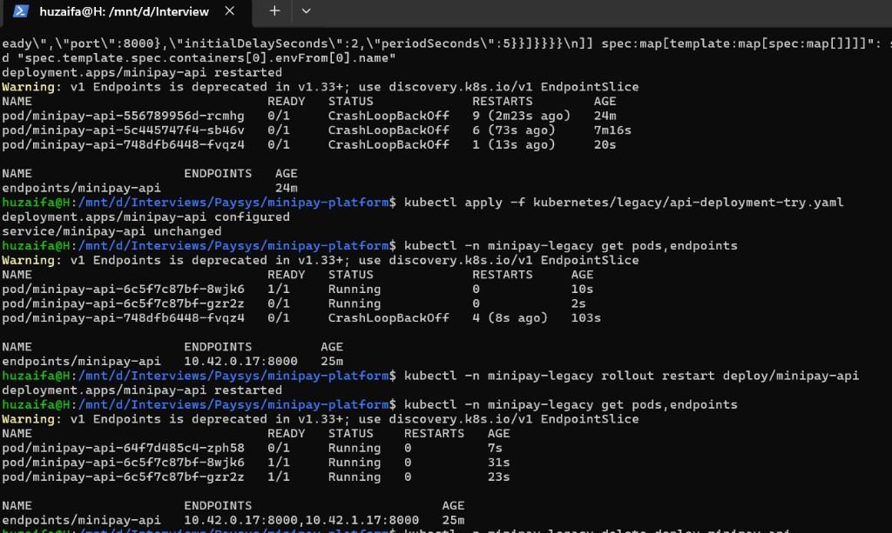

# INCIDENT-002 – Application unavailable after Kubernetes deploy

| | |
|---|---|
| Severity | P1 |
| Status | Resolved |
| Components | kubernetes / api |
| Author | Huzaifa Tanzeel |

## What happened

The first API manifest was applied to the cluster. Pods showed up but the app was not reachable: **CrashLoopBackOff**, **READY 0/1**, Service **Endpoints empty**. Users got errors through the UI (502 when the live Service `targetPort` was wrong).

## How we reproduced it

Applied [kubernetes/legacy/api-deployment-v0.yaml](../kubernetes/legacy/api-deployment-v0.yaml) in throwaway namespace **`minipay-legacy`** only (swap image to `minipay-api:1.0.0`, rewrite `namespace:`). Did **not** apply v0 to **`minipay`**.

```bash
kubectl create ns minipay-legacy
sed 's#YOUR_IMAGE_HERE#minipay-api:1.0.0#; s#namespace: minipay$#namespace: minipay-legacy#' \
  kubernetes/legacy/api-deployment-v0.yaml | kubectl apply -f -
kubectl -n minipay-legacy get pods          # 0/1 CrashLoopBackOff
kubectl -n minipay-legacy get endpoints minipay-api   # <none>
```

## What was wrong in v0 (simple list)

| # | v0 YAML | Problem | Symptom |
|---|---|---|---|
| 1 | `image: YOUR_IMAGE_HERE` | No real image | ImagePullBackOff (if not substituted) |
| 2 | env only `DB_HOST` | No `DATABASE_URL` / `API_KEY` | Process crashes at startup (logs: pydantic **Field required**) |
| 3 | `containerPort` / liveness **8080**, readiness **8081** | API listens on **8000** (see `backend/Dockerfile`) | Probes hit wrong ports → never Ready |
| 4 | Service selector `app: minipay-backend` | Pods labeled `app: minipay-api` | Endpoints **`<none>`** |
| 5 | Service `targetPort: 8081` | Nothing on 8081 | No traffic even after selector fix |

YAML `containerPort` does **not** change the process port — uvicorn still binds **8000**.

## Evidence

| File | Shows |
|---|---|
| [evidence/kubernetes/v0-get-pods.txt](../evidence/kubernetes/v0-get-pods.txt) | 0/1 CrashLoopBackOff |
| [evidence/kubernetes/v0-logs.txt](../evidence/kubernetes/v0-logs.txt) | Missing `database_url`, `api_key` |
| [evidence/kubernetes/v0-describe-pod.txt](../evidence/kubernetes/v0-describe-pod.txt) | Probes on 8080 / 8081 |
| [evidence/kubernetes/v0-endpoints.txt](../evidence/kubernetes/v0-endpoints.txt) | Endpoints `<none>` |
| [evidence/kubernetes/working-get-pods.txt](../evidence/kubernetes/working-get-pods.txt) | Fixed stack in `minipay`: 1/1, endpoints on **8000** |
| [evidence/kubernetes/incident-002-legacy-pods-fixed.png](../evidence/kubernetes/incident-002-legacy-pods-fixed.png) | After fixing try YAML in `minipay-legacy`: pods **1/1 Running**, endpoints **`…:8000`** |

Full line table: [kubernetes-findings.md](kubernetes-findings.md).

After correcting Secret + ports + selector in [kubernetes/legacy/api-deployment-try.yaml](../kubernetes/legacy/api-deployment-try.yaml) and re-applying:



`kubectl apply -f kubernetes/legacy/api-deployment-try.yaml` then `rollout restart` — two replicas **1/1**, Service endpoints list pod IPs on port **8000** (not `<none>`).

## Hypotheses

| Hypothesis | Result |
|---|---|
| Bad image tag | **Rejected** — same `minipay-api:1.0.0` works in `minipay` |
| Wrong ports / selector / missing Secret | **Confirmed** |

## Fix

Working manifests: [kubernetes/base/api.yaml](../kubernetes/base/api.yaml) + overlay. In short:

- Image `minipay-api:1.0.0`, `imagePullPolicy: IfNotPresent`
- Named port **`http: 8000`**; liveness `/health`, readiness `/ready` on that port
- Secret `minipay-secrets` + ConfigMap via **`envFrom`** (from `.env` at apply time)
- Service selector **`app: minipay-api`**, **`targetPort: http`** (port 80 → 8000)

Restore live stack if a drill file touched `minipay` by mistake:

```bash
kubectl apply -k kubernetes/overlays/local
```

## Check

```bash
kubectl -n minipay get pods              # api, web, db 1/1
kubectl -n minipay get endpoints minipay-api   # pod IP :8000, not <none>
curl -sS http://localhost:8080/ready     # {"status":"ready",...}
```

## Prevent

Run **`kubectl get endpoints`** after every deploy (empty = selector or not Ready). Use one named port for probes and Service. Apply only **`kubectl apply -k kubernetes/overlays/local`** to `minipay`; keep v0 in `minipay-legacy` for drills.


